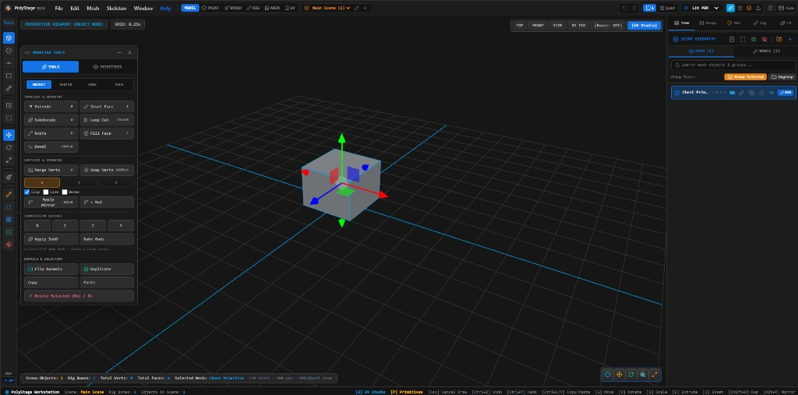
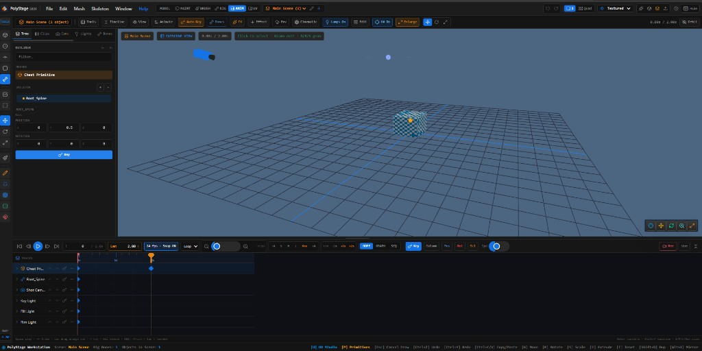
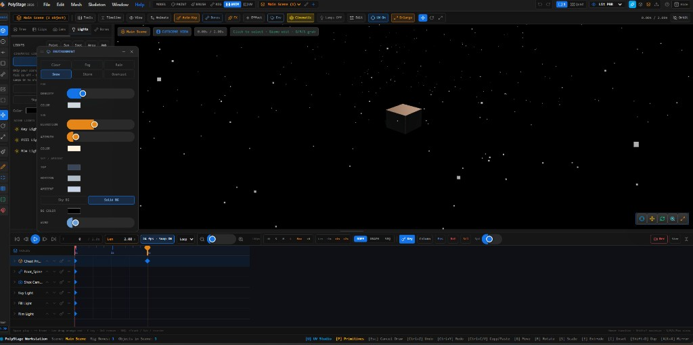
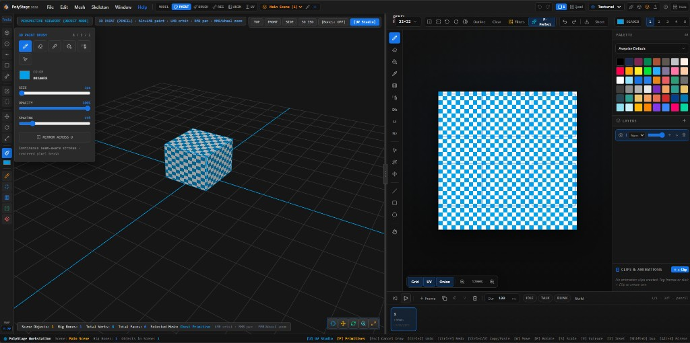
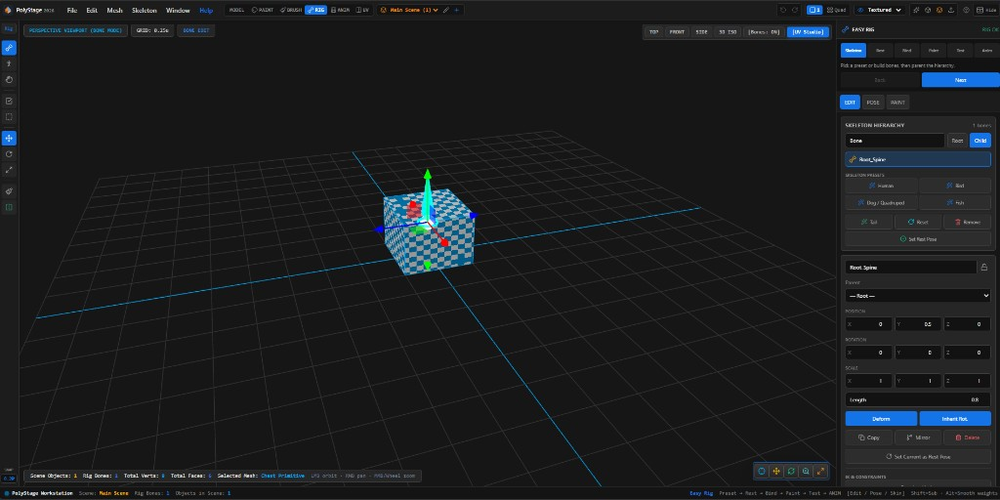

# PolyStage

**Low-poly game content studio** — model, paint, UV, rig, animate, and cutscenes in one app.



## Features

| Workspace | What you get |
|-----------|----------------|
| **MODEL** | Mesh editing, primitives, extrude / knife / bevel / loop cut |
| **PAINT** | Pixel texture studio + **3D paint on the model** (LMB paints, empty LMB orbits) |
| **BRUSH** | 3D brush workspace |
| **RIG** | Easy Rig — skeleton, bind, weight paint, pose test |
| **ANIM** | Dope sheet, graph editor, multi-track **Sequence** cutscenes |
| **UV** | UV unwrap / layout workspace |

### Cutscenes & cinematic

Cameras, Key / Fill / Rim lights, weather, titles, audio lanes, markers, transitions, and WebM record.





### Paint & texture

Paint in 2D or directly on the mesh in the viewport.



### Rigging

Guided Easy Rig flow: Skeleton → Bind → Weights → Paint → Test → Anim.



## Develop

```bash
npm install
npm run dev
```

```bash
npm run build
npm test
```

## Controls

| Input | Action |
|-------|--------|
| **LMB** drag (empty) | Orbit camera |
| **LMB** on mesh (Paint / Brush / Weight Paint) | Paint |
| **RMB** drag | Pan |
| **MMB / Wheel** | Zoom |
| **G / R / S** | Grab / Rotate / Scale (modal) |

## Project files

- Native: `.polystage`
- Legacy open: `.picocad2`

## License

Private / as published by the repository owner.
